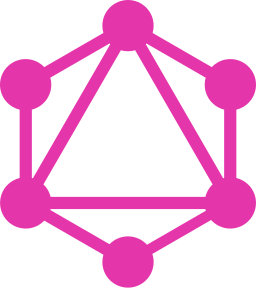
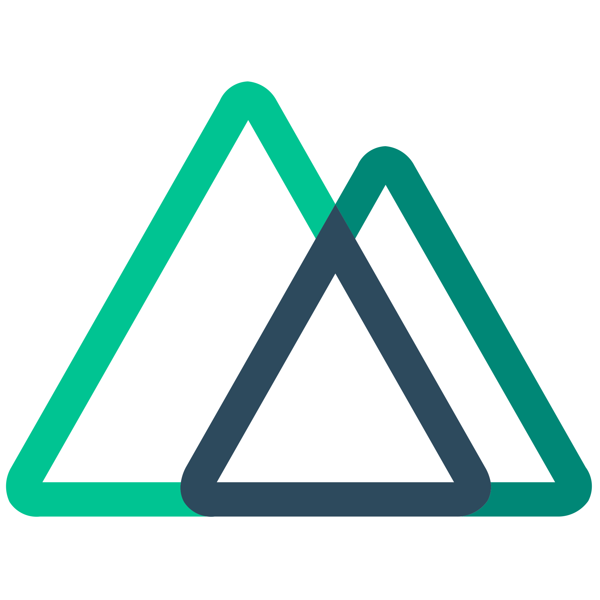
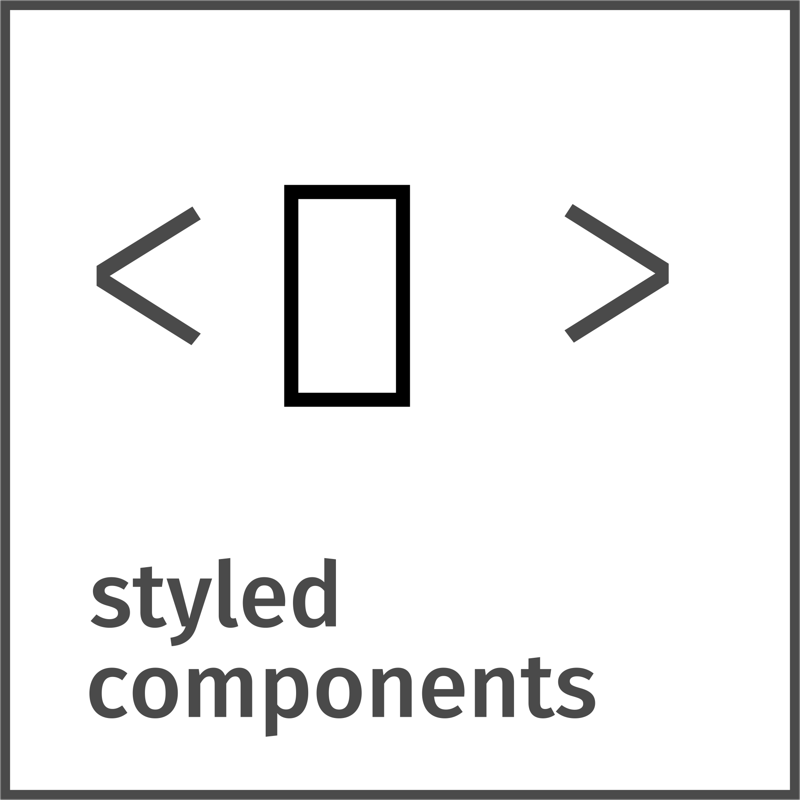
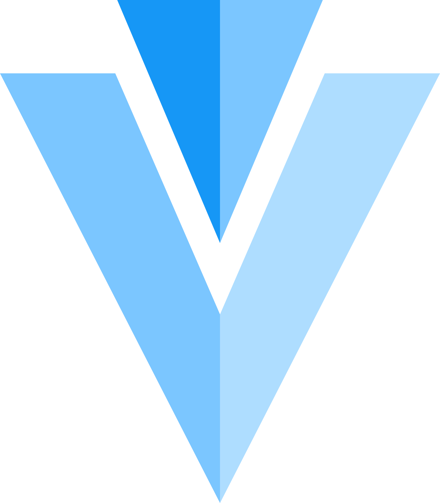
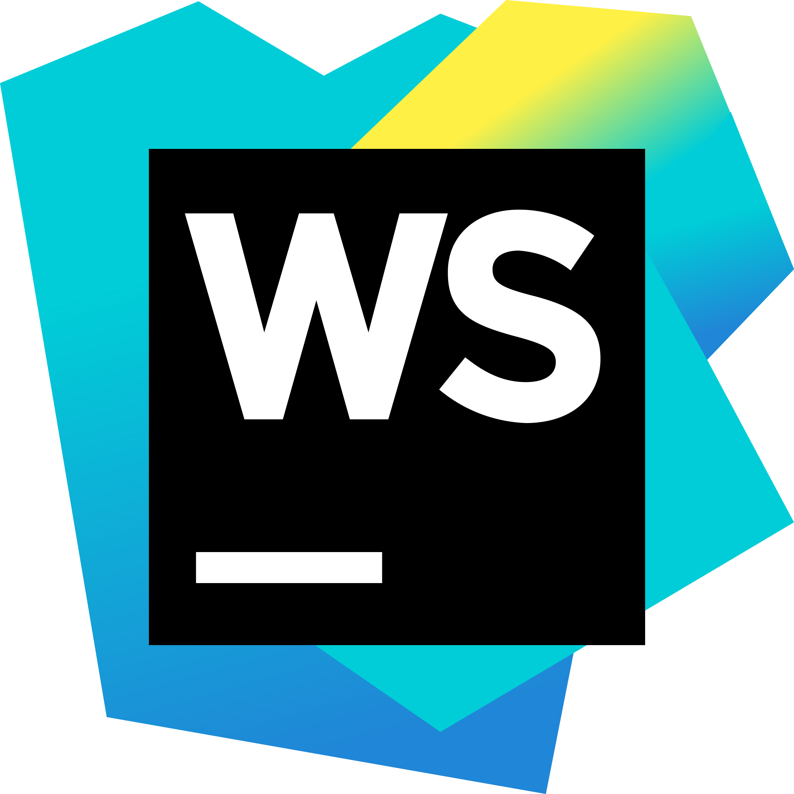

### Hi there, i'm [Thanh Vu](https://misa198.vercel.app/) &nbsp; 

#### 🧑🏻‍💻 &nbsp; About me

- 💡 &nbsp; Explore new technologies and develop web software solutions
- 🎓 &nbsp; Studied Information Technology at [Hanoi University of Science and Technology](https://hust.edu.vn/)
- 💼 &nbsp; Learning and working with web and mobile technologies

#### 💻 &nbsp; Tech Stack

- Languages

  <code></code>
  <code></code>
  <code></code>
  <code></code>
  <code></code>
  <code></code>

- Frameworks and libraries

  <code></code>
  <code></code>
  <code></code>
  <code></code>

  <code></code>
  <code></code>
  <code></code>
  <code></code>
  <code></code>
  <code></code>
  <code></code>
  <code></code>
  <code></code>

- Tools

  <code></code>
  <code></code>
  <code></code>
  <code></code>
  <code></code>
  <code></code>
  <code></code>

#### 📇 &nbsp; Reach me

  
  

